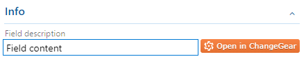

[](https://github.com/RicardoZambon/devops-markdown-text-control) [](https://github.com/RicardoZambon/devops-markdown-text-control/actions?query=workflow%3ASemantic-Release) [](https://github.com/RicardoZambon/devops-markdown-text-control/releases) [](https://github.com/semantic-release/semantic-release) [](https://marketplace.visualstudio.com/items?itemName=Ricardo-Zambon.devops-markdown-text-control)

# Azure DevOps Extension: Markdown Text Control

Azure DevOps extension to show text field control and markdown in same row.

[Learn how to build your own custom control for the work item form.](https://www.visualstudio.com/en-us/docs/integrate/extensions/develop/custom-control)

[More info about developing your own custom web extensions for Azure DevOps Services](https://docs.microsoft.com/en-us/azure/devops/extend/get-started/node?view=azure-devops)

 

### Usage ###

1. Clone the repository.
2. Open the Command Prompt and change to the directory where you cloned the project.  For instance, if it is cloned in a folder called "extensions" and saved as "vsts-sample-wit-custom-control", you will navigate to the following command line.

    > cd C:\extensions\vsts-sample-wit-custom-control
        
3. Run `npm install` to install required local dependencies.
4. Run `npm run publish`.
5. In your browser, navigate to your local instance of TFS, `http://YourTFSInstance:8080/tfs`.
6. Go to your personal Marketplace.
7. Click the Marketplace icon in the upper righthand corner.
8. Click "Browse local extensions" in the dropdown.
9. Scroll down and click on the "Manage Extensions" widget.
10. Click the button "Upload new extension".
11. Browse to the *.vsix* file generated when you packaged your extension.
12. Select the extension, and then click "Open".  Click "Upload" when the button activates.
13. Hover over the extension when it appears in the list, and click "Install".

You have now installed the extension inside your collection.  You are now able to put the control on the work item form.

## Make changes to the control

If you make changes to your extension files, you need to compile the Typescript and create the *.vsix* file again (steps 4-7 in the "Package & Upload to the marketplace" section).
 
Instead of re-installing the extension, you can replace the extension with the new *.vsix* package.  Right-click the extension in the "Manage Extensions" page and click "Update".  You do not need to make changes to your XML file again.

## Make API calls to the work item form service

Reading data from VSTS/TFS server is a common REST API task for a work item control.  The VSS SDK provides a set of services for these REST APIs.  To use the service, import it into the typescript file.

```typescript
import * as VSSService from "VSS/Service";
import * as WitService from "TFS/WorkItemTracking/Services";
import * as ExtensionContracts from "TFS/WorkItemTracking/ExtensionContracts";
import * as Q from "q";
```

## Commonly Needed
| API                | Functions                   | Usage                                                                     |
| ------------------ | --------------------------- | ------------------------------------------------------------------------- |
| VSSService         | VSS.getConfiguration()      | Returns the XML which defines the work item type.  Used in the sample to read the inputs of the control to describe its behavior.       |
| WitService         | getService()                | Returns an instance of the server to make calls.                     |
|                    | getFieldValue()             | Returns the field's current value.                                    |
|                    | setFieldValue()             | Returns the field's current value using your control.       |
|                    | getAllowedFieldValues()     | Returns the allowed values, or the items in a dropdown, of a field.                                    |


### How to invoke methods on a service call
 Create an instance of the work item service to get information about the work item.  Use one of the service's functions to get information about the field.  This example asks for the allowed values of a field.
```typescript
WitService.WorkItemFormService.getservice().then(
    (service) => {
        service.getAllowedFieldValues(this._fieldName), (allowedValues: string[]) => {
            // do something
        }
    }
)
```

### Recommendation: use Q with service calls
To wait on the response of multiple calls, you can use Q.  This example shows how to ask for the allowed values and the current value associated with a field using the Q.spread function.  You can make two parallel requests, and the code will not be executed until both services have returned a response.

```typescript
WitService.WorkItemFormService.getService().then(
    (service) => {
        Q.spread<any, any>(
            [service.getAllowedFieldValues(this._fieldName), service.getFieldValue(this._fieldName)],
            (allowedValues: string[], currentValue: (string | number)) => {
                //do something
            }
        )
    }
)
```

### Structure ###

```
/src                - Typescript code for this extension
/static/css         - Custom CSS assets for extension
/static/images      - Image assets for extension and description
/static/index.html  - Main entry point
```

#### Grunt ####

Two basic `npm` tasks are defined:

* `build` - Compiles TS files in `dist` folder
* `publish` - Generates the ```.vsix``` file to publishes the extension to the marketplace using `tfx-cli`