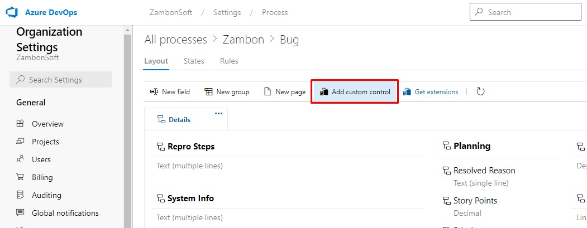
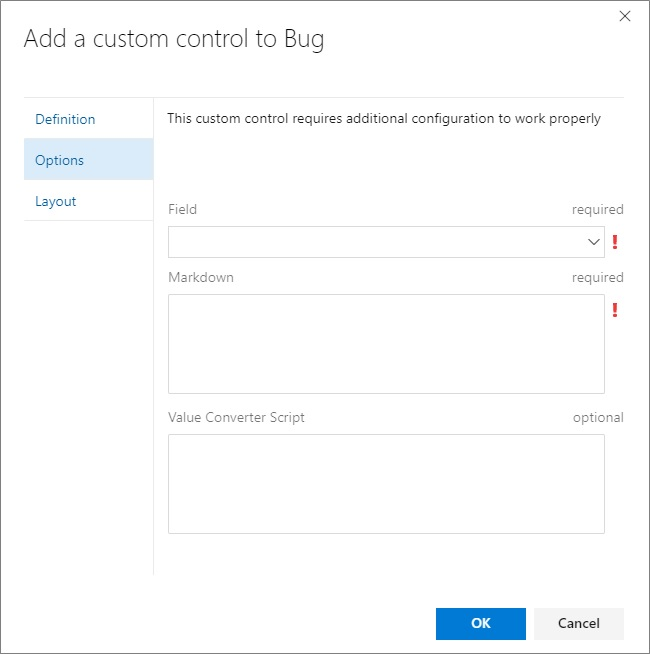

# Azure DevOps Extension: Markdown Text Control


Azure DevOps extension to show text field control and markdown in same row.

## Extension Usage

Navigate to your work item form customization page, click to ***Add custom control*** and select the control **Markdown Text Control**.



In ***Options*** tab, set the control *field*, *markdown* and a *value converter script* (if required).



* **Field** *(required)*: The field should be used by control;

* **Markdown** *(required)*: The markdown that will be displayin within control. You can use ${@fieldValue} macro anywhere in the text and this text will be replaced during runtime by reading the field value from current work item.

    **Example:**
    ```
	    Url: https://mbagra.visualstudio.com/DefaultCollection/customAgile/_workitems/edit/${@fieldValue=ID}

	    Assigned to value is ${@fieldValue=Assigned To}

	    State value is ${@fieldValue=State}
    ```

* **Value converter script** *(optional)*: Script to apply custom rule converter when displaying ```@{fieldValue}```. The function need receive two parameters, field name and value, and need return the final value.

    If not informed any script, will use the field value itself.

    **Example:**
    ```javascript
    function valueConverter(field, value) {
        switch (field) {
            case 'id':
                return 'ID: ' + value;
        };
    }
    ```

## Source code

The [source](https://github.com/RicardoZambon/devops-markdown-text-control) for this extension can be found on Github - feel free to take, fork and extend.

You can also learn how to build your own custom control extension for the work item form [here](https://www.visualstudio.com/en-us/docs/integrate/extensions/develop/custom-control).

## Feedback
We need your feedback! Here are some ways to connect with us:

* Add a review below.
* Report issues in [GitHub](https://github.com/RicardoZambon/devops-markdown-text-control).